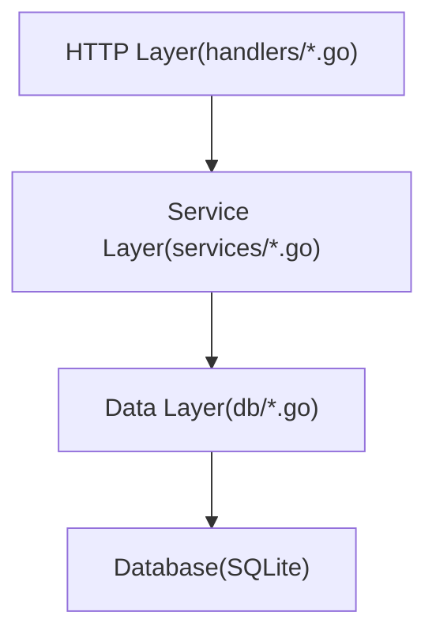
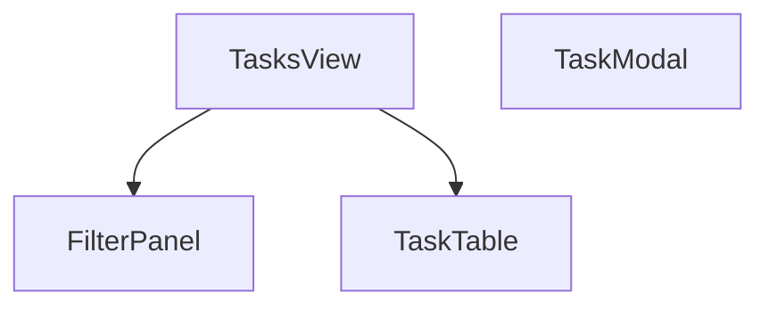
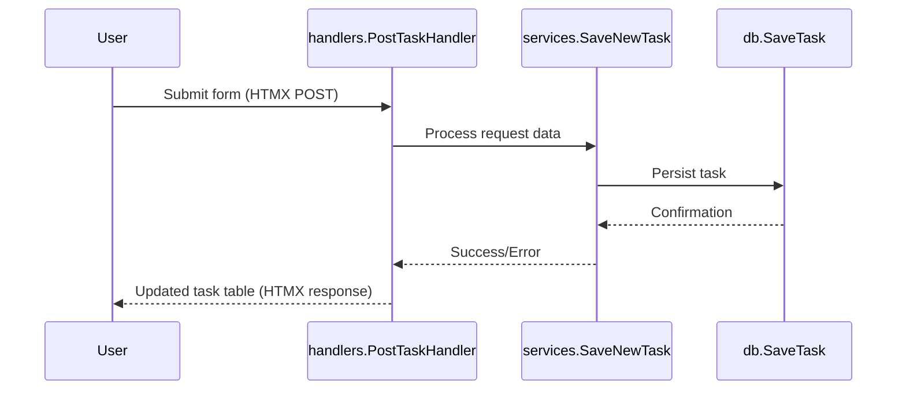
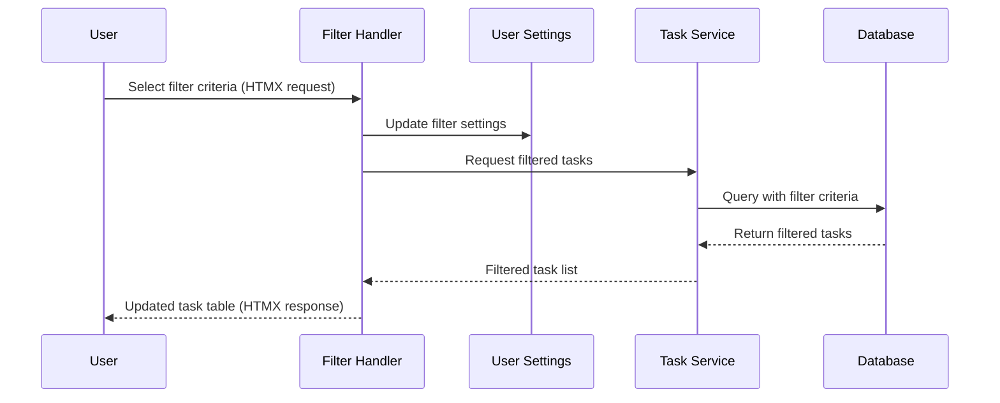
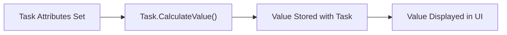
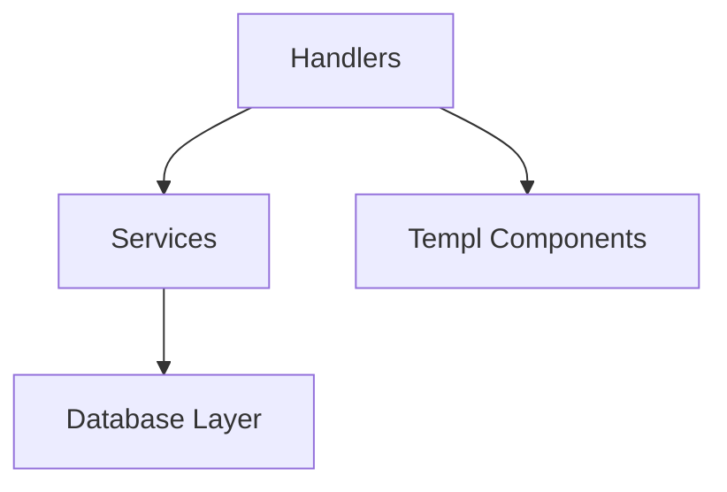
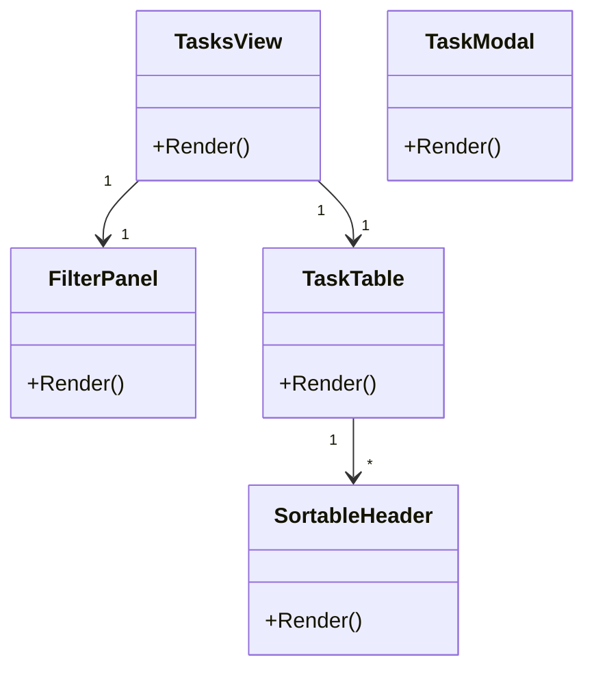

# System Patterns: PrioTasks

## System Architecture

PrioTasks follows a layered architecture pattern with clear separation of concerns:

### UI Components (Templ)

## Design Patterns

### Repository Pattern
- Implemented in the `db` package
- Abstracts database operations from business logic
- Provides a clean interface for data access

### Service Layer Pattern
- Implemented in the `services` package
- Encapsulates business logic
- Coordinates between handlers and data access

### Component-Based UI
- UI elements organized as reusable components
- Each component has a single responsibility
- Components can be composed to create complex views

### Model-View Pattern
- Models defined in the `models` package
- Views implemented as Templ components
- Clear separation between data and presentation

## Key concepts and models
- `models/tasks.go` - The primary entity of the project, contain `Task` struct
- `models/settings.go` - Supporting logic, primary user settings. Contains all the preferences and the table filtration settings.
- Every entity such as `Task` or `Settings` are persisted in the database. Whenever you change or introduce new fields to these structs you must also update their SQL tables accordingly. Typically you can find their table definitions in their `db` file, for instance `go/dbtasks.go` or `go/dbsettings.go` respectively. Remember to always introduce migration for the DB changes. See `initSettings()` and `settingsTableAddTagsColumn()` for examples. 

## Critical Implementation Paths

### Task Creation Flow

### Task Filtering Flow

### Task Value Calculation

## Component Relationships

### Handler Dependencies

### Service Dependencies
- Services depend on the database layer for data access
- Services implement business logic independent of UI concerns

### Database Layer
- Provides a unified interface for data operations
- Abstracts the underlying database implementation
- Supports different database backends (currently SQLite)

### Component Hierarchy

